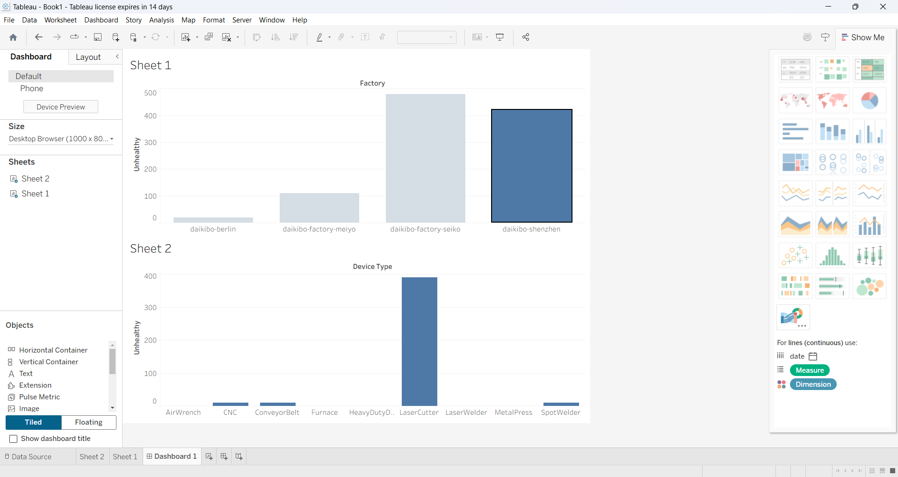

# Sales Data Dashboard – Deloitte Virtual Internship (Tableau)

## 📌 Project Overview
This project was developed as part of the Deloitte Technology Virtual Experience Program on Forage.  
The objective was to analyze sales data and build an interactive Tableau dashboard to support business decision-making.

## 🛠 Tools Used
- Tableau
- Microsoft Excel

## 📊 Dashboard Preview

## 📈 Key Insights
- Identified regions with higher sales contribution
- Analyzed product performance trends
- Highlighted patterns useful for business decision-making

## 📁 Repository Structure
- `data/` → Dataset used for analysis  
- `dashboard/` → Tableau dashboard screenshots  

## 🎓 Learning Outcome
This project strengthened my data analysis, data visualization, and storytelling skills using a real-world business scenario.

